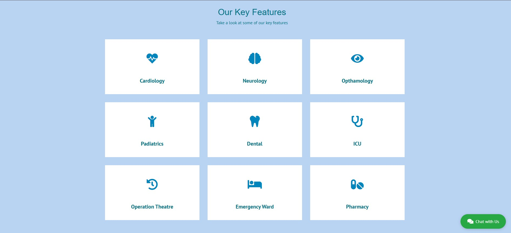
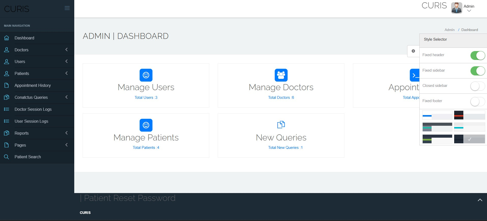
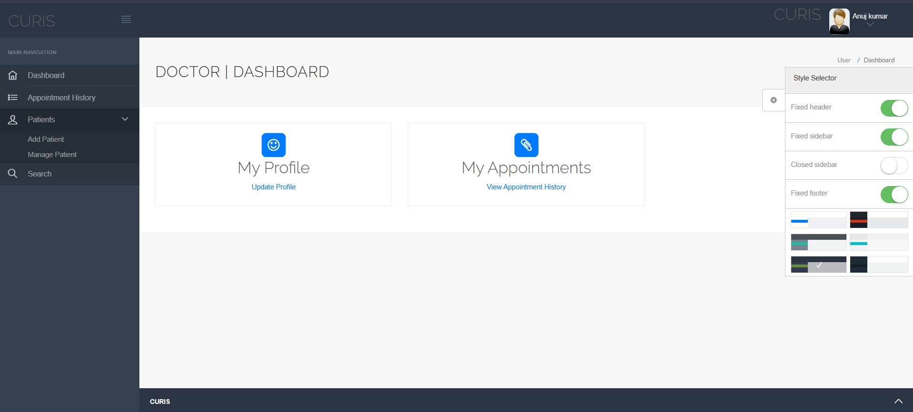
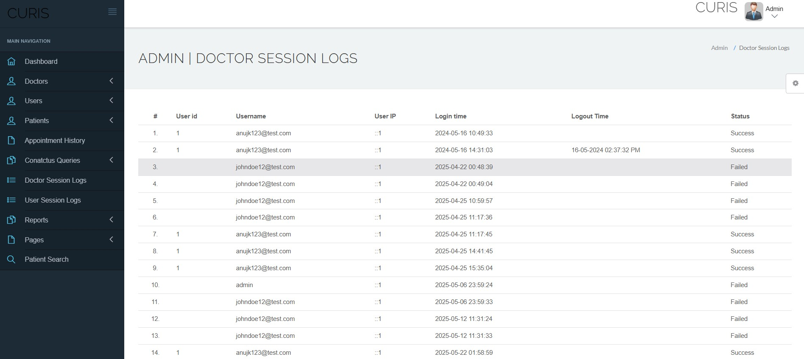
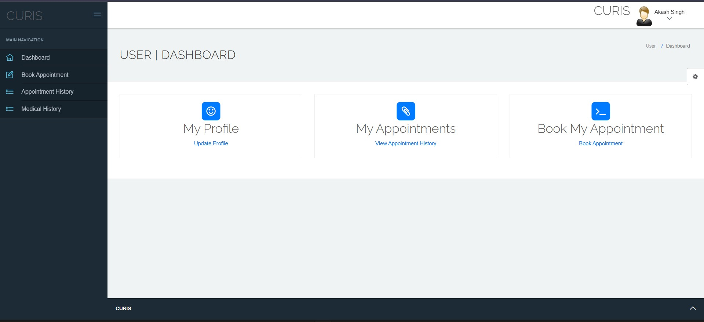
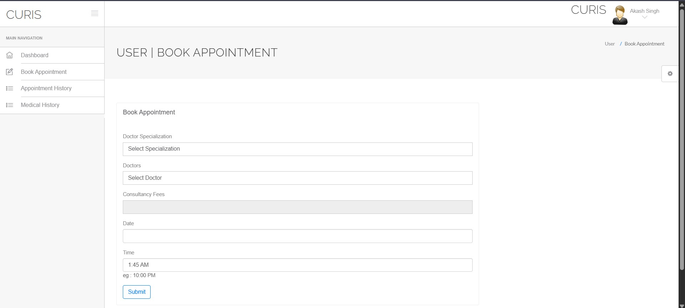
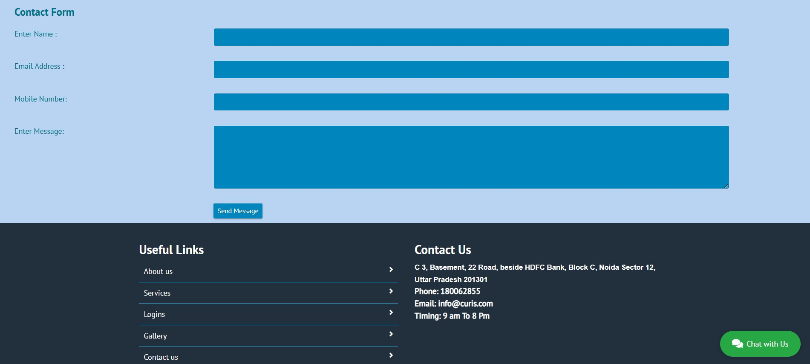

# 🏥 Hospital Management System (HMS)

A web-based **Hospital Management System** developed using **PHP and MySQL** to manage hospital operations efficiently. This system helps in handling patient records, doctor schedules, and appointment bookings with a user-friendly interface.

---

## 🚀 Features

* 👨‍⚕️ **Admin Panel**

  * Manage doctors and patients
  * View appointments
  * Control system data

* 🩺 **Doctor Panel**

  * View assigned patients
  * Manage appointments
  * Update patient status

* 👤 **Patient Panel**

  * Register & login
  * Book appointments
  * View medical history

* 🔐 **Authentication System**

  * Secure login for Admin, Doctors, and Patients

---

## 🛠️ Tech Stack

* **Frontend:** HTML, CSS, JavaScript
* **Backend:** PHP
* **Database:** MySQL

---

## 📁 Project Structure

```
curis-hms/
 ├── hospital/
 ├── SQL File/
 ├── README.md
 └── .gitignore
```

---

## ⚙️ Installation & Setup

1. Clone the repository

```
git clone https://github.com/rajmanvi17/curis-hms.git
```

2. Move project to **htdocs** (for XAMPP)

3. Import the database

* Open phpMyAdmin
* Create a new database
* Import `.sql` file from `SQL File` folder

4. Run the project

* Start Apache & MySQL in XAMPP
* Open browser and go to:

```
http://localhost/hospital
```

---

## 📸 Screenshots
## 📸 Screenshots

### 🏠 Home Page


### ✨ Key Features Section


### 🔐 Login Page


### 👨‍💼 Admin Dashboard


### 👨‍⚕️ Doctor Dashboard


### 🩺 Doctor Session


### 👤 Patient Dashboard


### 📅 Appointment Booking


### 🖼️ Gallery


### 📞 Contact & Footer


## 🌟 Future Improvements

* Online payment integration
* Email/SMS notifications
* Improved UI/UX

---

## 🙌 Author

**Manvi Raj**

* GitHub: https://github.com/rajmanvi17

---

## ⭐ Support

If you like this project, give it a ⭐ on GitHub!
